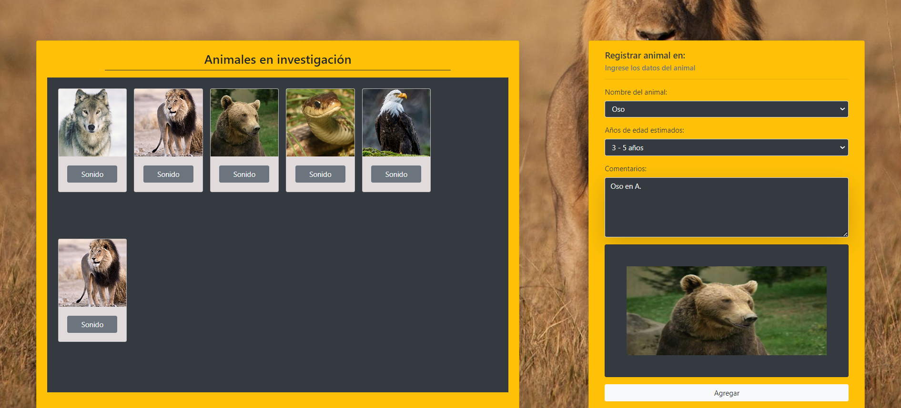

- [Aplicación Web de Investigación de Animales Salvajes](#aplicación-web-de-investigación-de-animales-salvajes)
  - [Características](#características)
  - [Requerimientos del Proyecto](#requerimientos-del-proyecto)
  - [Consideraciones](#consideraciones)

Desarrolladora : Ana Celeste Pérez

# Aplicación Web de Investigación de Animales Salvajes
`Descripción:`  
Esta aplicación web se ha desarrollado para ayudar a los investigadores de animales salvajes en Australia a registrar y gestionar comentarios sobre los animales en estudio. Utiliza un enfoque de Programación Orientada a Objetos (POO) para modelar los animales y sus características, y permite registrar cada animal en una tabla interactiva. La aplicación también reproduce los sonidos de los animales y muestra detalles en una ventana modal al hacer clic en las imágenes.

## Características
`Registro de animales con:`  
-Nombre   
-Edad    
-Comentarios.   
-Visualización de una imagen previa del animal seleccionado.   
-Reproducción de sonidos asociados a cada animal.   
-Ventana modal para mostrar los detalles del animal registrado.

## Requerimientos del Proyecto

`Clases e Herencia:` Implementar las clases representadas en el diagrama de clases proporcionado, utilizando herencia.

`Instancias de Clases:` Crear instancias de las clases utilizando los datos proporcionados por un formulario de entrada.

`Consulta Asíncrona:` Realizar una consulta asíncrona utilizando async/await para obtener las imágenes de los animales.

`Función Autoejecutable (IIFE):` Implementar al menos una función autoejecutable (IIFE).

`Módulos ES6:` Dividir el código en módulos para una mejor organización y reutilización del código.

`Manipulación del DOM:` Mostrar en una tabla los animales registrados a través del formulario de entrada.

## Consideraciones

`Validaciones:` Asegurarse de que el usuario ha proporcionado todos los datos necesarios antes de agregar un animal a la tabla.

`Restablecer Formulario:` Devolver el formulario a su estado inicial después de registrar cada animal.

`Interacción de Audio:` Programar la funcionalidad del botón de audio para reproducir el sonido correspondiente a cada animal.

`Ventana Modal:` Mostrar los detalles de cada animal en una ventana modal al hacer clic en su imagen.[Ir al inicio](#aplicación-web-de-investigación-de-animales-salvajes).